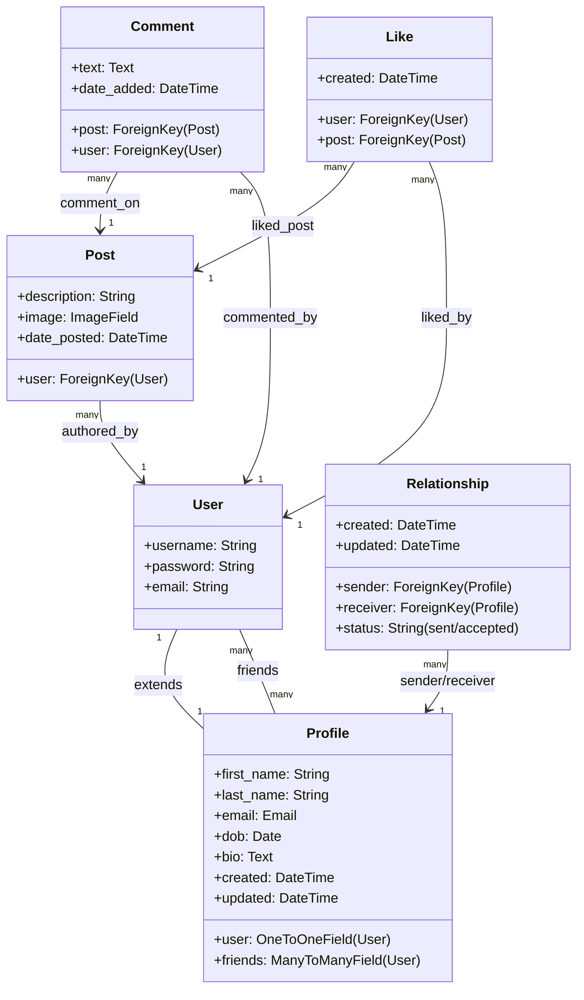

# FeedApp Documentation

Welcome to the **FeedApp** documentation. This directory contains detailed specifications and user scenarios outlining how this Django-based social media application behaves.

## Project Overview
**FeedApp** is a simple, modern social network built with Django 3.2. It enables users to register accounts, maintain custom profiles, share posts with text and image uploads, interact with other users' posts via likes and comments, and build a social network through a custom friendship/relationship request workflow.

## Documentation Index
- [**User Scenarios**](file:///C:/Documents/Documents/AdvPython/social_media_project/docs/user_scenarios.md): Step-by-step guides covering all user interactions, workflows, edge cases, and underlying technical details.

---

## Technical Stack & Architecture

### Core Technologies
* **Framework**: Django 3.2 (Python 3)
* **Database**: SQLite (default file-based database: `db.sqlite3`)
* **Frontend**: HTML5, Vanilla CSS (custom styles in `FeedApp/static/FeedApp/style.css`), Bootstrap 4 (via `django-bootstrap4` & `django-crispy-forms`)
* **Media Handling**: Pillow (for uploading and rendering user-submitted images in posts)

### Apps Structure
The project is modular and split into two primary applications under the main Django project configuration (`FeedProject/`):

1. **`users/`**
   * Handles user authentication and account creation.
   * Leverages Django's built-in authentication system for login, logout, password management, and sessions.
   * Implements a custom registration view and form.

2. **`FeedApp/`**
   * Implements the core social features of the platform: user feeds, post creation, comments, liking, and friendship workflows.
   * Manages user profile extensions (`Profile`) and request-based relationships (`Relationship`).

---

## Data Models Relationship
Here is a high-level representation of how the models in `FeedApp/models.py` interact:

To explore details of how a user interacts with these views and database structures, please proceed to [**User Scenarios**](file:///C:/Documents/Documents/AdvPython/social_media_project/docs/user_scenarios.md).
